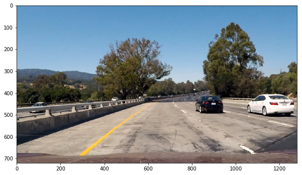

### Writeup / README

#### 1. Provide a Writeup / README that includes all the rubric points and how you addressed each one.  You can submit your writeup as markdown or pdf.  [Here](https://github.com/udacity/CarND-Advanced-Lane-Lines/blob/master/writeup_template.md) is a template writeup for this project you can use as a guide and a starting point.  

All code is provided in the [project.ipynb](https://github.com/chappers/CarND-Advanced-Lane-Lines/blob/master/project.ipynb) file in this folder

### Camera Calibration

#### 1. Briefly state how you computed the camera matrix and distortion coefficients. Provide an example of a distortion corrected calibration image.

The camera calibration step was based on the same code provided in the sample [udacity camera calibration repo](https://github.com/udacity/CarND-Camera-Calibration/blob/master/camera_calibration.ipynb)

This was fairly straight forward to use and it works in the way one might expect. An example from the `drawChessBoardCorners` is below:


Then if we simply load up an `undistort_image` function with the parameters learned from the calibration, we can show than an input image:


yields an undistorted output:

 

### Pipeline (single images)

#### 1. Provide an example of a distortion-corrected image.

For the distortion corrected image, it would simply follow the same approach



undistorted output:


#### 2. Describe how (and identify where in your code) you used color transforms, gradients or other methods to create a thresholded binary image.  Provide an example of a binary image result.

The pipeline was written in the section under "Pipeline Stuff"

For the pipeline the following approach was used:

1.  We made use of the sobel pipeline as suggested in the lectures
    *  similar to the first project, we altered all yellows to white
2.  We made use of the R and S channels in the RGB and HSL representations. 
    *  In order to determine thresholds, the approach used was an ensemble or voting like approach. Each channel was equalised using CLAHE (as shown in the traffic signal project) and the equalise histogram with all results used via `np.median` to determine a robust "average" value where the threshold could finally be applied over.

Both of these were there taken together in a binary fashion. 


#### 3. Describe how (and identify where in your code) you performed a perspective transform and provide an example of a transformed image.

The code for my perspective transform includes a function called `warper()`, which appears in the section under "Perspective Transform"

This was created using a variety of "good" estimates (scaling width and height by 0.5) and various offsets. The final result was 

```python
width, height = img.shape[1], img.shape[0]
off_center = -50
scale_factor = 460
offset_top=60
offset_bottom=450

offset_top_dst = 300
offset_bottom_dst = 350

src = np.float32([
    [(width*0.5) - offset_top, scale_factor], 
    [(width*0.5) + offset_top, scale_factor], 
    [(width*0.5) + offset_bottom, height], 
    [(width*0.5) - offset_bottom, height]])
dst = np.float32([           
    [(width*0.5) - offset_bottom_dst, max((height*0.5) - scale_factor, 0.0)], 
    [(width*0.5) + offset_top_dst, max((height*0.5) - scale_factor, 0.0)], 
    [(width*0.5) + offset_top_dst + off_center, height], 
    [(width*0.5) - offset_bottom_dst + off_center, height]
])
```

This resulted in the following source and destination points:

| Source        | Destination   | 
|:-------------:|:-------------:| 
| 580, 460      | 290, 0        | 
| 700, 460      | 940, 0      |
| 1090, 720     | 890, 720      |
| 190, 720      | 240, 720        |

<!-- 

| Source        | Destination   | 
|:-------------:|:-------------:| 
| 585, 460      | 320, 0        | 
| 203, 720      | 320, 720      |
| 1127, 720     | 960, 720      |
| 695, 460      | 960, 0        |

-->

I verified that my perspective transform was working as expected by drawing the `src` and `dst` points onto a test image and its warped counterpart to verify that the lines appear parallel in the warped image.


#### 4. Describe how (and identify where in your code) you identified lane-line pixels and fit their positions with a polynomial?

In order to fit the 2nd order polynomial I opted for using `scikit-learn` instead of `np.polyfit`. The reasoning was I thought I could use `SGDRegressor` with `partial_fit` in order the adaptively control for the lane fitting across frames for the harder challengers. Unfortunately this didn't work so well, but the `LinearRegression` model works perfectly fine. The code to do this is under "Lane Detection" and looks like this:

```python
from sklearn.linear_model import LinearRegression
from sklearn.preprocessing import PolynomialFeatures

poly = PolynomialFeatures()
left_mod = LinearRegression()
right_mod = LinearRegression()

lefty_poly = poly.fit_transform(lefty.reshape(-1, 1))
righty_poly = poly.fit_transform(righty.reshape(-1, 1))

left_fit = left_mod.fit(lefty_poly, leftx)
right_fit = right_mod.fit(righty_poly, rightx)

ploty = np.linspace(0, binary_warped.shape[0]-1, binary_warped.shape[0] )
ploty_poly = poly.fit_transform(ploty.reshape(-1, 1))
left_fitx = left_fit.predict(ploty_poly)
right_fitx = right_fit.predict(ploty_poly)

```

When fitting the line and accessing the plot we can transform an image like this one:


To this:


#### 5. Describe how (and identify where in your code) you calculated the radius of curvature of the lane and the position of the vehicle with respect to center.

TO DO

#### 6. Provide an example image of your result plotted back down onto the road such that the lane area is identified clearly.

This step was implemented "draw full pipeline" step (TO DO) 


---

### Pipeline (video)

#### 1. Provide a link to your final video output.  Your pipeline should perform reasonably well on the entire project video (wobbly lines are ok but no catastrophic failures that would cause the car to drive off the road!).

The final video can be found in the base directory: [project_video_attempt1.mp4](./project_video_attempt1.mp4)

---

### Discussion

#### 1. Briefly discuss any problems / issues you faced in your implementation of this project.  Where will your pipeline likely fail?  What could you do to make it more robust?

The key idea in the approach I've taken is to try to do an ensemble approach. Much like how the Sobel used a combination of different techniques to get a superior result, I took a combination of different approaches with the R and S channel to yield a superior result. 

When testing the pipeline on the harder examples it doesn't perform as well. This is probably due to the fact that there is no "memory" across different frames. 

One way of making it "smarter" is perhaps introducing a custom online algorithm for learning the linear model so that it will not over correct itself when training on new incoming data. 
